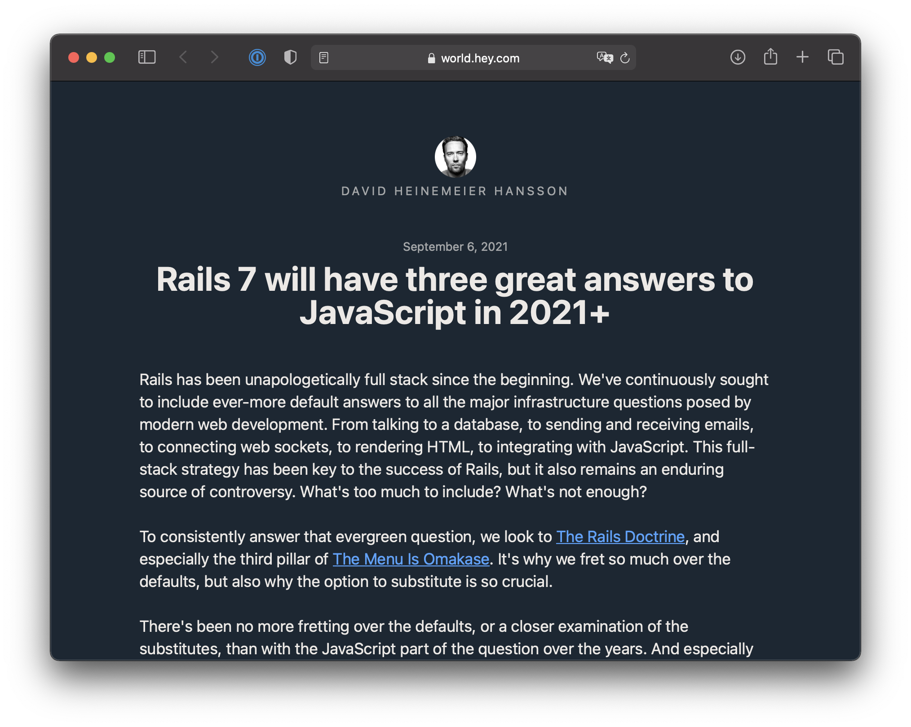

---
presentation:
    theme: black.css
---  
  
  
<!-- slide -->
  
  
#  Rails Meetup 2021
  
  
Hoelzle AG
Gregor Wassmann
<small>MSc ETH</small>
  
<!-- slide -->
  
  

  
<!-- slide -->
  
  

  
<!-- slide -->
  
  

  
<!-- slide -->
  
  
Please find slides and source code on
[github.com/hoelzle/rails-meetup-2021](https://github.com/hoelzle/rails-meetup-2021 )
  
<!-- slide -->
  
  
#  Modular Monolith
  
  
Bonus: Best of Rails _and_ JavaScript
  
  
<!-- slide -->
  
  

  
<!-- slide -->
  
  
#  Entropy
  
  
<!-- slide -->
  
  

  
<!-- slide -->
  
  
> While software development is immune from almost all physical laws, the inexorable increase in entropy hits us hard. Entropy is a term from physics that refers to the amount of “disorder” in a system.
  
— David Thomas, Andrew Hunt.
The Pragmatic Programmer.
  
<!-- slide -->
  
  
##  Entropy always increases
  
  
Second law of thermodynamics.
  
<!-- slide -->
  
  
Thought experiment
  
<!-- slide -->
  
  
  

  
  
<!-- slide -->
  
  

  
  
<!-- slide -->
  
  

  
  
<!-- slide -->
  
  
#  Complexity
  
  
- Same number of nodes
- Edges: 
  - Monolith: 
  - Modular Monolith: 
  
<!-- slide -->
  
  
#  Complexity
  
  
##  
  
  
<!-- slide -->
  
  
You’re in good company.
  
<!-- slide -->
  
  
https://shopify.engineering/deconstructing-monolith-designing-software-maximizes-developer-productivity
  
  
<!-- slide -->
  
  
https://medium.com/@dan_manges/the-modular-monolith-rails-architecture-fb1023826fc4
  
<!-- slide -->
  
  
#  Rails Engine
  
  
<!-- slide -->
  
  
  
```
 rails plugin new ./engines/core --full
 rails plugin new ./engines/api --mountable
```
  
  
  
<!-- slide -->
  
  
`spec/dummy` is your friend
  
<!-- slide -->
  
  
```
rails app:railties:install:migrations
```
  
<!-- slide -->
  
  
**don’t do this**
  
<!-- slide -->
  
  
```ruby
# Source: https://tanzu.vmware.com/content/blog/leave-your-migrations-in-your-rails-engines
initializer :append_migrations do |app|
  unless app.root.to_s.match root.to_s
    config.paths['db/migrate'].expanded.each do |path|
      app.config.paths['db/migrate'] << path
    end
  end
end
```
  
<!-- slide -->
  
  
#  Webpacker
  
  
<!-- slide -->
  
  
Ask @coorasse
  
<!-- slide -->
  
  

  
<!-- slide -->
  
  
#  JavaScript and Rails
  
  
<!-- slide -->
  
  

  
<!-- slide -->
  
  
https://world.hey.com/dhh/rails-7-will-have-three-great-answers-to-javascript-in-2021-8d68191b
  
<!-- slide -->
  
  
###  Three choices for JS
  
  

  
  
1. import maps
2. jsbundling-rails
3. Rails API with separate SPA
  
<!-- slide -->
  
  
###  The 4th choice
  
  
Simple. Obvious. Best of both worlds?
  

  
  
<!-- slide -->
  
  
- 1 repo
- 1 CI
- 1 deployment (Heroku)
- different stacks
- `clients/crm`
- `public/crm ➔ ../../clients/crm/dist`
  
<!-- slide -->
  
  
Works with Rails 0.5
  
<!-- slide -->
  
  
RSpec and FactoryBot.
End-to-end testing.
  
<!-- slide -->
  
  

  
  
  
<!-- slide -->
  
  

  
  
<!-- slide -->
  
  
#  Momo
  
  
Modular Monolith
  
<!-- slide -->
  
  

  
<!-- slide -->
  
  

  
<!-- slide -->
  
  

  
<!-- slide -->
  
  
There is no right or wrong.
Be pragmatic.
  
<!-- slide -->
  
  
Questions?
  
<!-- slide -->
  
  
Thanks
  
<!-- slide -->
  
#  TODO
  
  
- [x] Core engine
- [ ] API engine
- [ ] JS / Svelte client
- [ ] Administrate
- [ ] Shop
- [ ] Device
- [ ] Github pages
- [ ] Omniauth
- [ ] Standardrb
- [ ] RSpec
- [ ] CI
- [ ] Ruby 3 / Rails 7
- [ ] Hotwire
- [ ] Importmaps
- [ ] Spyke
- [ ] ActionCable
- [ ] Docker
- [ ] install:migrations **NOT**
  
  
<!-- slide -->
  
  
#  Why API?
  
  
1. Separation of concerns
1. Different kinds of clients
1. Offline / native clients
1. Technological independence / decoupling
1. Standards such as JsonAPI
1. Every developer knows what it is
1. Minimal attack surface
1. Future proof (Jamstack and what not)
  